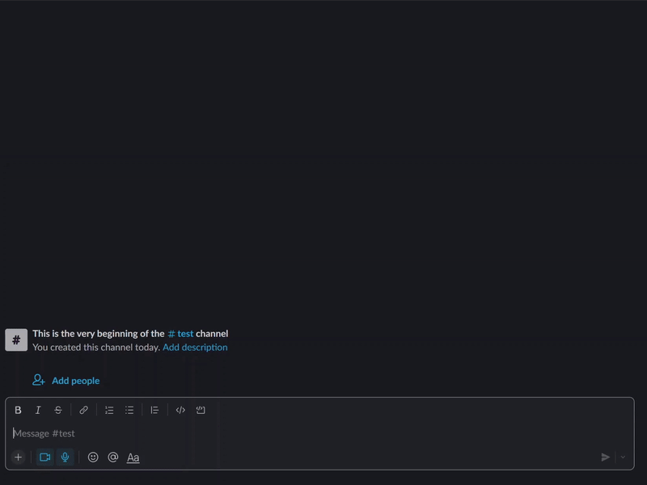

# AtRacker


## Overview


A slackbot that tracks rating changes of AtCoder users. It displays rankings and reminds users of contest dates.

## Requirement
- Python 3.10.5
- Slack 4.27.154
- Bolt for Python 1.14.0
- autopep8 1.6.0

See [requirements.txt](requirements.txt) for external libraries including bolt.

## Setup
- To run this project, you need to [create an slack app](https://slack.dev/bolt-python/tutorial/getting-started#:~:text=over%20HTTP.-,Create%20an%20app,-First%20thing%E2%80%99s%20first) and [get the Tokens](https://slack.dev/bolt-python/tutorial/getting-started#:~:text=configuring%20your%20app%20%F0%9F%94%A9-,Tokens%20and%20installing%20apps,-Slack%20apps%20use).
- Add the Token to <your token> in the root folder [.env](/.env).
- Finally, [set up events](https://slack.dev/bolt-python/tutorial/getting-started#:~:text=up%20and%20running.%20%F0%9F%8E%89-,Setting%20up%20events,-Your%20app%20behaves).

## Usage


### Install library
```
$ pip install -r requirements.txt
```
### Run
```
$ python -m atcoder_awarder
```

## Author / Contact
Twitter: [@__dike__](https://twitter.com/__dike__)<br>
Email: [okayaman0509@gmail.com](okayaman0509@gmail.com)